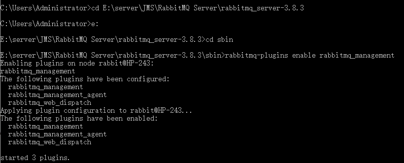
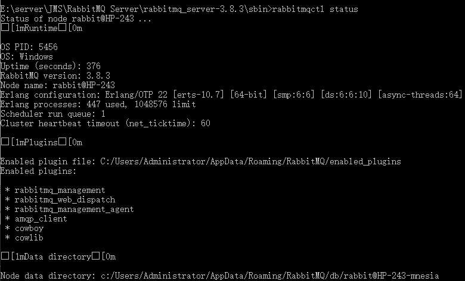
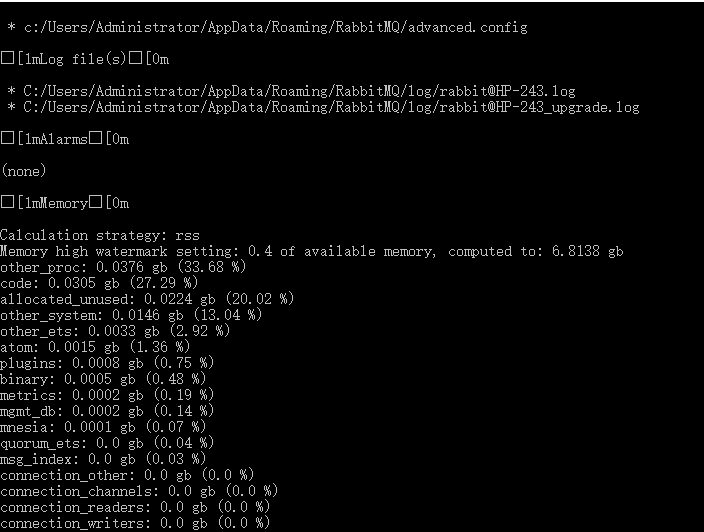
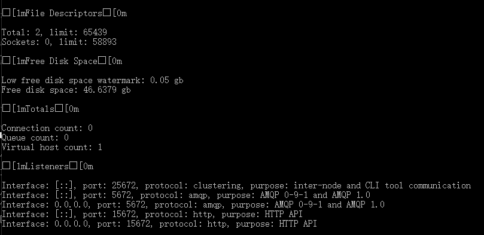
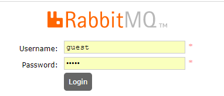
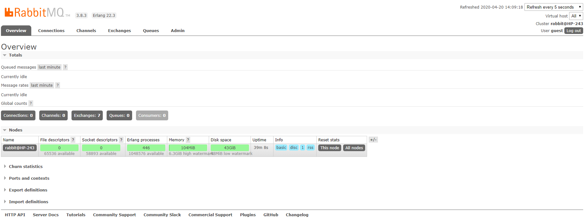

# 安装

## window

### 安装erlang

#### 下载

下载地址：http://www.erlang.org/downloads

#### 设置环境变量

- 创建一个名为ERLANG_HOME的环境变量，其值指向erlang的安装目录

- 将%ERLANG_HOME%\bin加入到Path

- 打开命令行，输入erl，如果出现erlang的版本信息就表示erlang语言环境安装成功

### 安装RabbitMQ

#### 下载

下载地址：http://www.rabbitmq.com/

#### 安装RabbitMQ-Plugins

这个相当于是一个管理界面，方便我们在浏览器界面查看RabbitMQ各个消息队列以及exchange的工作情况

- 打开命令行cd进入rabbitmq的sbin目录，输入：rabbitmq-plugins enable rabbitmq_management命令

  

- 输入rabbitmqctl status

  

  

  

  #### 访问RabbitMQ

  浏览器输入http://localhost:15672

  输入用户名：guest，密码：guest

  

  

# springboot+RabbitMQ